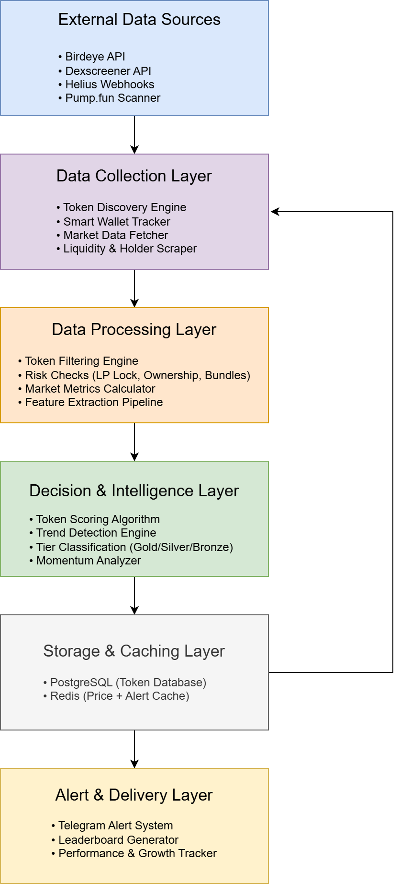

# DroxenBot — Autonomous AI Agent for Early Detection and Decision-Making in High-Velocity Digital Markets
### Research Project Repository

Author: Abdullahi Labaran  
B.Eng Computer Engineering (AI & Data Science)  
Research Interests: Autonomous Systems, Machine Learning, Modeling & Simulation  
Year: 2026

## Abstract

DroxenBot is an experimental AI-driven market intelligence agent designed to detect early-stage digital assets with high growth potential using real-time on-chain activity, market microstructure, and behavioral wallet signals.

The system combines decentralized exchange analytics, blockchain data streams, and algorithmic scoring to identify emerging assets before major price discovery occurs.

This project explores how **autonomous decision systems** can operate continuously in noisy, high-velocity financial environments.

## Research Motivation

Unlike traditional financial markets, decentralized markets are:

• Real-time

• Noisy and unstructured

• Highly volatile

• Dominated by behavioral signals

Early detection of promising assets requires autonomous systems capable of:

• Continuous monitoring

• Noise filtering

• Opportunity ranking

• Real-time reaction under uncertainty

DroxenBot investigates how **AI-style agents** can operate in such environments.

## Research Questions

This project explores:

1. Can algorithmic filters detect promising assets earlier than human traders?

2. Which on-chain signals correlate with large market movements?

3. Can smart-wallet behavior serve as a predictive feature?

4. How can autonomous agents reduce noise in speculative markets?

## Key Contributions

This project contributes the following:

• Design of a real-time autonomous monitoring pipeline for decentralized markets 

• Development of a multi-stage token filtering and ranking system  

• Empirical observation of behavioral wallet activity as an early signal  

• Iterative optimization improving signal precision from 20% → ~75%  

• Deployment of a live production system delivering real-time alerts

## System Architecture

### Agent Pipeline
Token Discovery
Monitor newly launched tokens
Track trending assets across DEX markets

#### Data Aggregation
Liquidity depth
Market cap & volume velocity
Transaction activity
Smart wallet accumulation
Holder distribution
#### Filtering Engine
Removes high-risk or low-quality tokens using rule-based filters.

#### Scoring Engine
Tokens are ranked into tiers:

Bronze → Early signal

Silver → Strong momentum

Gold → High-confidence trend

#### Real-Time Alerts
Automated alert system for newly detected signals and growth milestones.

The diagram below shows the end-to-end pipeline of DroxenBot.



## Live Deployment

The system has been deployed as a production Telegram bot and has been operating continuously in real market conditions.

Over the research period:

• ~9 months of continuous monitoring 

• Thousands of tokens analyzed 

• Real users subscribed to alerts  

• Ongoing performance tracking of detected assets

## Experimental Evolution

The system was iteratively improved over a **9-month research period**.

| Phase | Signals / Day | Hit Rate |
|------|---------------|---------|
| Early Prototype | 80 | 10–20% |
| Optimized System | 10–15 | 70–80% |

This demonstrates the impact of **iterative signal filtering and optimization**.

## Technical Stack

| Component | Technology |
|----------|------------|
| Language | Python |
| Backend | FastAPI |
| Database | PostgreSQL |
| Cache | Redis |
| Blockchain Data | Helius API |
| Market Data | DEX Analytics APIs |
| Deployment | Railway / Render |

## Project Structure

```
DroxenBot/
│
├── core/                # Data collection & processing modules
├── filters/             # Token filtering & risk checks
├── alerts/              # Telegram alert & notification system
├── database/            # PostgreSQL & Redis integration
├── utils/               # Helper functions
├── docs/                # Documentation & architecture diagram
│   └── architecture.png
└── README.md
```

## Methodology

### Feature Engineering Signals

The system evaluates assets using:

Liquidity depth

Buy/Sell pressure ratio

Volume growth rate

Holder concentration

Smart wallet accumulation

Time since launch

Market cap momentum

Scoring Strategy

Weighted heuristic model combining:

**Market Metrics + On-Chain Signals + Behavioral Indicators**

## Research Relevance

This work connects to research areas in:

• Autonomous Agents

• Real-time AI Systems

• Modeling & Simulation

• Multi-Agent Decision Systems

• Data-Driven Forecasting

Over a 9-month experimental period, the system continuously monitored newly launched digital assets and tracked post-detection performance.

### Key observations:
• Signal filtering dramatically improved precision over time  
• Behavioral wallet activity showed strong correlation with major growth events  
• Early-stage assets exhibit measurable momentum patterns detectable via real-time data streams  

These results motivate further research into machine learning ranking models and reinforcement learning agents for automated decision-making.

## Future Research Directions

Machine learning ranking models

Reinforcement learning for automated trading

Simulation environments for strategy testing

Cross-chain predictive modeling

Risk-aware portfolio allocation

## Disclaimer

This project is for research and educational purposes only and does not constitute financial advice.
