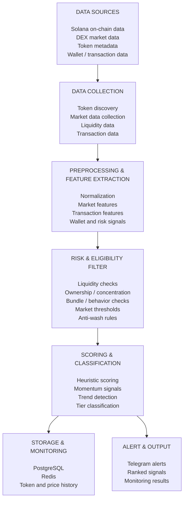

# DroxenBot: A Real-Time Autonomous Agent for On-Chain Detection and Ranking of Emerging Digital Assets

### Research Project Repository

**Author:** Abdullahi Labaran  
**Background:** B.Tech Computer Engineering (AI & Data Science)  
**Research Interests:** Autonomous Systems, Applied Machine Learning, AI Engineering, Modeling & Simulation  
**Email:** baffahlabaran01@gmail.com                                                           
**LinkedIn:** www.linkedin.com/in/abdullahi-labaran                                                                                      
**Year:** 2026


> **Research repository:** This public repository documents the research design, system architecture, methodology, and experimental evolution of DroxenBot. The production implementation is maintained separately from this repository.

---

## Abstract

DroxenBot is an experimental autonomous market-intelligence agent designed to monitor and rank emerging digital assets using real-time on-chain activity, decentralized-exchange market data, and behavioral wallet signals.

The system combines blockchain data streams, decentralized-exchange analytics, rule-based risk and eligibility filtering, and heuristic scoring to prioritize newly launched assets for continuous monitoring.

The project investigates how autonomous decision-support systems can operate in noisy, high-velocity financial environments where newly launched assets have limited historical information available at detection time.

---

## Research Motivation

Newly launched decentralized assets can emerge and begin trading within short periods, creating a rapidly changing environment for continuous monitoring.

Compared with established financial assets, newly launched tokens may have limited historical information available when they first become observable. Early-stage monitoring therefore requires systems capable of:

* Continuous data collection
* Feature extraction from heterogeneous signals
* Risk and eligibility filtering
* Candidate prioritization
* Real-time alert generation
* Post-detection monitoring

DroxenBot investigates how a rule-based autonomous monitoring system can combine these processes into a continuous decision-support pipeline.

---

## Research Questions

The project investigates:

1. Can algorithmic filtering help identify potentially significant emerging assets at an early stage of their market activity?
2. Which on-chain and market signals are useful for prioritizing newly launched assets for monitoring?
3. Can wallet-behavior signals provide useful information for early-stage asset monitoring?
4. How can autonomous monitoring systems reduce noise when evaluating rapidly changing decentralized markets?

---

## Key Contributions

The project explores:

* A real-time autonomous monitoring pipeline for newly launched decentralized assets
* A multi-stage architecture combining data collection, preprocessing, risk screening, scoring, classification, storage, and alert delivery
* Integration of heterogeneous market, transaction, liquidity, and wallet-related signals
* Rule-based risk and eligibility filtering prior to candidate scoring
* Heuristic scoring and tier classification for monitoring prioritization
* Post-detection tracking of selected assets and growth milestones
* Iterative system development based on observations collected during live deployment

The reported performance observations are discussed as **observational findings rather than controlled predictive-performance estimates**. The accompanying research paper documents the measurement limitations and proposes a more rigorous evaluation protocol.

---

# System Architecture

DroxenBot is organized as a staged monitoring pipeline:


```mermaid
flowchart TD
    A["DATA SOURCES<br/><br/>Solana on-chain data<br/>DEX market data<br/>Token metadata<br/>Wallet / transaction data"]

    B["DATA COLLECTION<br/><br/>Token discovery<br/>Market data collection<br/>Liquidity data<br/>Transaction data"]

    C["PREPROCESSING & FEATURE EXTRACTION<br/><br/>Normalization<br/>Market features<br/>Transaction features<br/>Wallet and risk signals"]

    D["RISK & ELIGIBILITY FILTER<br/><br/>Liquidity checks<br/>Ownership / concentration<br/>Bundle / behavior checks<br/>Market thresholds<br/>Anti-wash rules"]

    E["SCORING & CLASSIFICATION<br/><br/>Heuristic scoring<br/>Momentum signals<br/>Trend detection<br/>Tier classification"]

    F["STORAGE & MONITORING<br/><br/>PostgreSQL<br/>Redis<br/>Token and price history"]

    G["ALERT & OUTPUT<br/><br/>Telegram alerts<br/>Ranked signals<br/>Monitoring results"]

    A --> B
    B --> C
    C --> D
    D --> E
    E --> F
    E --> G
```

The architecture separates data acquisition, feature construction, risk screening, candidate evaluation, state management, monitoring, and alert delivery within a continuous monitoring pipeline.

---

## Pipeline Stages

### 1. Data Sources

The system operates on heterogeneous inputs including:

* Solana on-chain data
* Decentralized-exchange market data
* Token metadata
* Wallet and transaction information

### 2. Data Collection

The collection stage discovers candidate assets and gathers:

* Market data
* Liquidity information
* Transaction activity
* Relevant wallet-related signals

### 3. Preprocessing & Feature Extraction

Raw observations are transformed into structured signals including:

* Market features
* Transaction features
* Liquidity-related features
* Wallet and behavioral signals
* Time-based features

### 4. Risk & Eligibility Filtering

Rule-based checks remove candidates that fail configured criteria involving:

* Liquidity
* Ownership and concentration
* Behavioral or bundle-related signals
* Market thresholds
* Anti-wash-trading rules

These checks are intended for operational risk screening and noise reduction. They do **not** guarantee that an asset is safe, legitimate, or profitable.

### 5. Scoring & Classification

Candidates that pass the filtering stage are evaluated using a weighted heuristic scoring process.

The resulting score is used to:

* Prioritize candidates
* Identify momentum-related signals
* Detect trends
* Assign monitoring tiers

The tiers are intended for prioritization and are **not calibrated probabilities of future price appreciation**.

### 6. Storage & Monitoring

The system maintains persistent and frequently accessed state using:

* PostgreSQL
* Redis
* Token and price history

Selected assets can subsequently be monitored for changes in market activity and predefined growth milestones.

### 7. Alert & Output

Candidates meeting configured conditions can generate:

* Telegram alerts
* Ranked monitoring signals
* Post-detection monitoring results

---

# Experimental Evolution

The system was iteratively developed and evaluated during an approximately nine-month research period.

| Phase            | Approx. Signals / Day | Observed Hit Rate |
| ---------------- | --------------------: | ----------------: |
| Early prototype  |                   ~80 |           ~10–20% |
| Optimized system |                ~10–15 |           ~70–85% |

> **Important measurement note:** *These hit-rate figures are observational estimates from the project's deployment period. They were not produced using a single fixed success threshold applied consistently across all stages, nor were they evaluated against a controlled baseline. Consequently, they should not be interpreted as standard precision, recall, accuracy, or validated predictive performance.*

The accompanying research paper provides the measurement methodology, limitations, and proposed evaluation protocol for obtaining more rigorous performance estimates.

---

# Live Deployment

During the research period, DroxenBot was deployed as a Telegram-based monitoring system and operated under live market conditions.

The deployment period involved:

* Approximately nine months of iterative development and monitoring
* Large-scale observation of newly launched assets
* Automated Telegram alert delivery
* Post-detection tracking of selected assets
* Continuous refinement of filtering and scoring rules

The production implementation is maintained separately from this public research repository.

---

# Technical Stack

| Component       | Technology         |
| --------------- | ------------------ |
| Language        | Python             |
| Backend         | FastAPI            |
| Database        | PostgreSQL         |
| Cache           | Redis              |
| Blockchain Data | Helius API         |
| Market Data     | DEX analytics APIs |
| Messaging       | Telegram Bot API   |
| Deployment      | Railway / Render   |

---

# Repository Structure

This public repository contains research documentation and architecture materials rather than the complete production implementation.

```text
DroxenBot-Research/
│
├── docs/
│   └── architecture.svg
│
├── src/
│   └── README.md
│
├── README.md
├── LICENSE
└── requirements.txt
```

The full production system is maintained separately. The public repository is intended to provide a reproducible description of the research design, architecture, methodology, and experimental evolution without exposing the complete production implementation or proprietary filtering configuration.

---

# Methodology

## Feature Signals

The system evaluates candidates using heterogeneous signals such as:

* Liquidity depth
* Buy/sell pressure
* Volume activity
* Holder concentration
* Wallet activity
* Time since launch
* Market-capitalization momentum
* Transaction activity

These signals are combined after preprocessing and risk/eligibility filtering.

---

## Scoring Strategy

DroxenBot uses a weighted heuristic scoring approach combining:

**Market metrics + on-chain activity + behavioral indicators**

The resulting score is used for candidate prioritization and monitoring-tier assignment.

The current system is intentionally heuristic rather than a trained predictive machine-learning model. Future work will evaluate learned ranking approaches against the existing heuristic system.

---

# Research Relevance

This project connects to:

* Autonomous Agents
* Real-Time Systems
* Applied Machine Learning
* Modeling & Simulation
* Data-Driven Decision Support
* Blockchain Analytics

---

# Key Observations

Observations during the deployment period included:

* Iterative filtering was associated with a reduction in the number of daily signals and an increase in the project's observed hit-rate estimates.
* Wallet and behavioral activity was frequently observed alongside assets that subsequently experienced substantial market-capitalization growth.
* Newly launched assets exhibited rapidly changing market and transaction signals that motivated continuous rather than purely historical analysis.

These are **observational findings from live deployment**. They do not establish causality, statistical significance, or generalizable predictive performance.

---

# Limitations

The current study has several limitations:

* No controlled randomized baseline
* No consistently applied success threshold across the full development period
* No formal precision, recall, F1, or calibration analysis for the reported historical hit-rate estimates
* Potential selection and survivorship effects
* Changing market conditions across the development period
* Heuristic thresholds were iteratively refined during development
* The current evaluation does not establish causal relationships between individual signals and subsequent market movements

These limitations motivate the evaluation framework proposed for future work.

---

# Future Research Directions

1. **Rigorous Evaluation Protocol**
   Apply a fixed success criterion consistently across detections and report appropriate classification and ranking metrics.

2. **Baseline Comparisons**
   Compare the multi-stage system against random selection and simple single-metric filtering strategies.

3. **Machine-Learning Ranking**
   Train supervised or semi-supervised ranking models using accumulated detection history and compare them with the current heuristic scorer.

4. **Temporal and Graph-Based Modeling**
   Represent wallet and transaction relationships as temporal graphs for behavioral analysis.

5. **Simulation and Backtesting**
   Replay historical market streams under controlled experimental conditions.

6. **Cross-Chain Generalization**
   Evaluate whether the monitoring framework can be adapted to additional blockchain ecosystems.

7. **Risk-Aware Decision Support**
   Incorporate uncertainty estimates and explicit liquidity constraints into candidate prioritization.

8. **Autonomous Execution as a Separate Research Problem**
   Evaluate automated execution independently under controlled risk limits rather than conflating execution performance with monitoring performance.

---

# Paper

The full research paper documents the system architecture, methodology, related work, observational findings, limitations, and proposed evaluation framework.

**Preprint:** *To be added after arXiv publication.*

---

# Disclaimer

DroxenBot is a research and educational project. Nothing in this repository constitutes financial, investment, or trading advice.

Digital-asset markets are highly speculative and can involve substantial financial loss. Historical observations from the project should not be interpreted as guarantees of future performance.

---

## Citation

If you reference this research, please cite the associated preprint after publication:

```text
A. Labaran, "DroxenBot: A Real-Time Autonomous Agent for On-Chain Detection and Ranking of Emerging Digital Assets," 2026.
```
